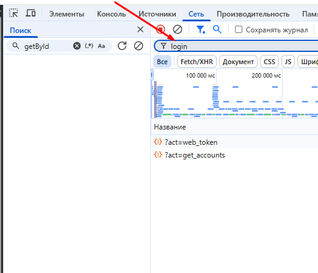
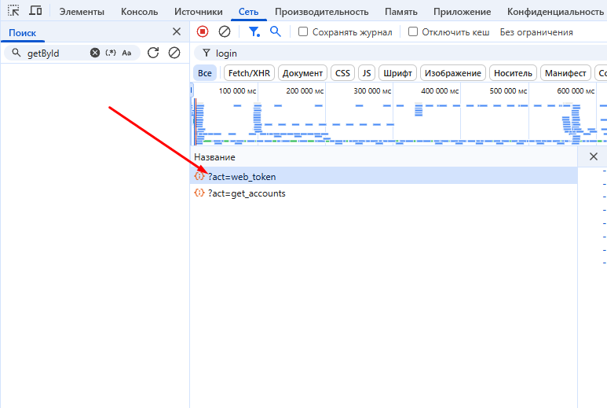
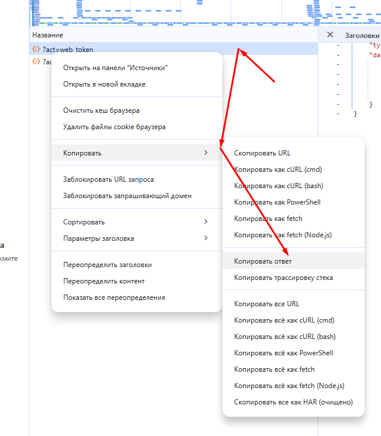

# vk-music-downloader
CLI with useful tool to work with VK Music

# How to get access token? (Как получить токен?)
1. Откройте ВК
2. Нажмите правую кнопку -> Посмотреть код

3. В открвышемся окне нажмите Сеть

4. В фильтры напишите "login"

5. Перезагрузите страницу
6. Далее в окне нужно найти "?act=web_token"

7. Нажмите правой кнопкой мыши, "Копировать" и "Копировать ответ"

8. Вставьте в CLI

Так придётся делать довольно часто, так как более адекватного и быстрого способа авторизации я не нашёл, VK скрыло часть апишки

Copyright 2025 Taburkin Vladimir

Licensed under the Apache License, Version 2.0...
